# Coders Coffee

Coders Coffee is a website for coffee lovers to buy exciting new and different coffee's.
This website is aimed at coders with a gifts section with different mugs and coasters that make for a greate 
gift. The website also feature's a blog / news selection so user can see what the business is up to adding a personal touch to 
the business. 

## User Experience (UX)
### Site Goals
- For this store I want users to easily be able to understand what the website sells and about the company.
- Users should easily be able to check products with minimal clicks.
- Returing customers must be able to save there details for an easier checkout the next time they order

The website needs to enable **Site users** to:
- Find Coffee new a exciting coffee or gifts for themselves, friends or family.
- Be able to add their products to a shooping bag to purchase within as few clicks as possible.
- Search and filter products to quickly find what they are looking for.
- Notified of when something happens, such as a product being added to the bag.
- View blog post by the business.

The website needs to enable **Registered users** to:
- Save information on checking out.
- Have a profile where they can update their information and see past orders
- Leave a Review on a product.

The website needs to enable **Site owners** to:
- Add, edit and delete products from the data base.
- View all orders from the admin panel.
- Review and remove ratings on products.
- Manage all user accounts.

### User Stories
#### Site User
- As a customer I can add or remove items from my basket so that I don't have items I don't want.
- As a customer I can choose from different sizes so that I have the best size to suit my needs.
- As a customer I can filter products (eg: by rating) so that I can find the most popular products quickly.
- As a customer I can search for a product by name so that I can quickly find a product.
- As a customer I can adjust the products in my bag so that I can quickly change an item if I add the quantity.
- As a customer I will receive a confirmation email so that I know my order has gone through.
- As a customer I can sort by a category so that I can only see products I'm interested in.
- As a site user I can receive notifications so that I know what's happen after I do something(eg: add an item to the bag).

#### Registered User
- As a customer I can leave a rating on a product so that I can help other customers with their product choices.
- As a customer I can create an account so that my details can be saved so that I can have an easier time checking out next time.
- As an account holder I can reset my password so that if I forget it I can get back into my account.
- As a customer I can receive a confirmation email so that I know my account registered.

#### Site Owner
- As a site owner I can update products so that they are up to date for customers.
- As a site owner I can delete old product so that customers cannot buy them when they aren't available.
- As a site owner I can create blog posts so that users can keep up to date with what the business is doing.
- As a site owner I can edit blog posts so that the information can be up to date.
- As a site owner I can delete a blog post so that **only relevant post will be there **

## Agile
In this project I used agile works flows to help keep on track and understand where my project is in the development cycle.

### Kanban Board and Issues

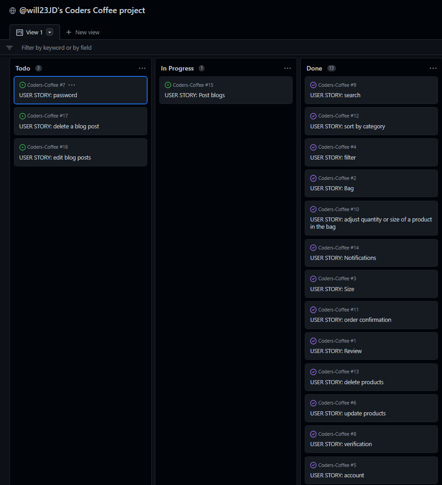

Github Issues were used to create user stories which where placed into a [backlog](https://github.com/will23JD/Coders-Coffee/milestone/1). and added to a [project](https://github.com/users/will23JD/projects/2).
I used the Kanban board colums Todo, In progress and Done to keep track of user stories as I moved through the project. This kept me on track through the
cycle of development.

## Website Structure

### Site Map
I use site map to see where different templates and apps would need to connect to allow the user easily navigate through the site.

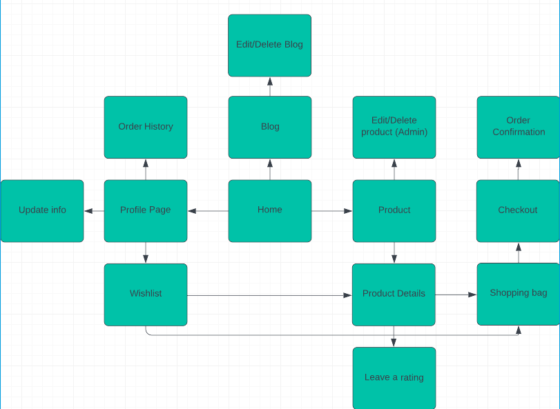

### Wireframes

Large screen frames

Home page

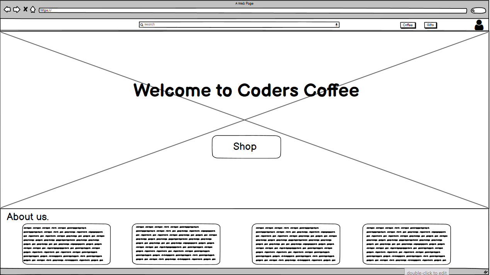

I wanted the home page to be clean simple but also provide users everything they need to access all areas of the site.

Store pages

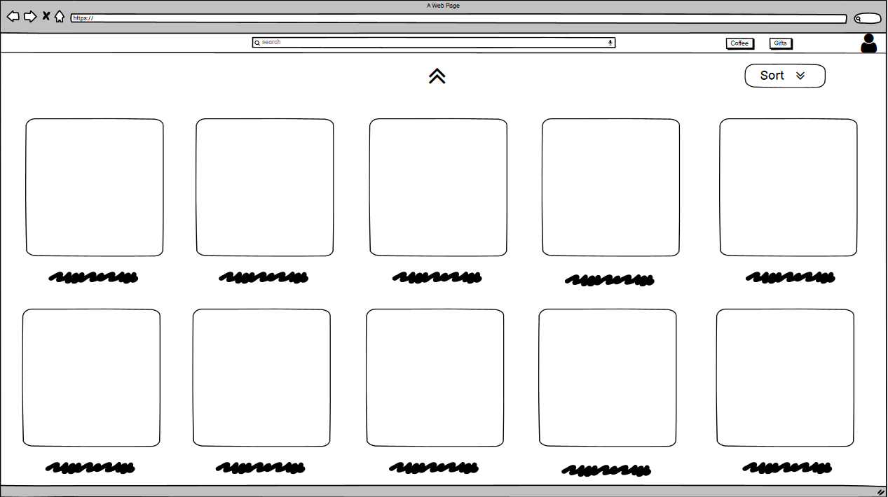

For the main products page gave it a simple look to put the focus on the products. The page also features sort box which will allows uses
to sort based on their needs.

Account page

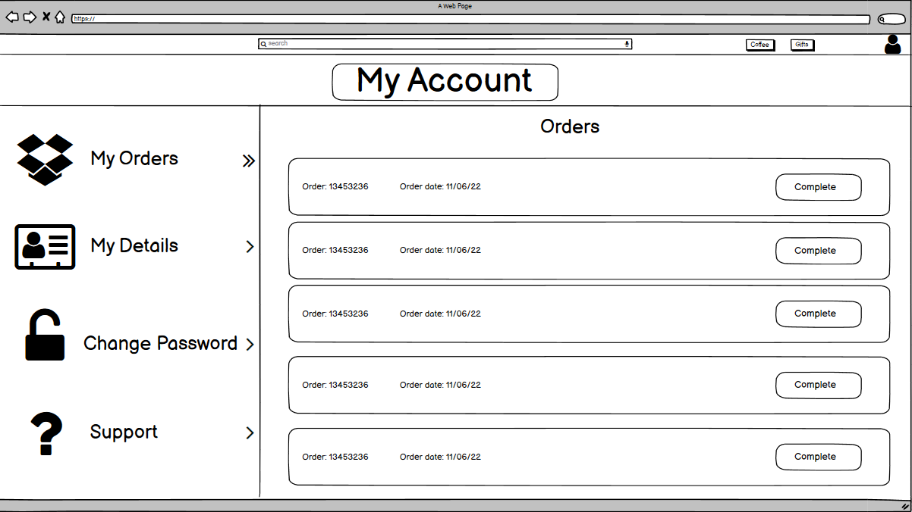

Favourites page

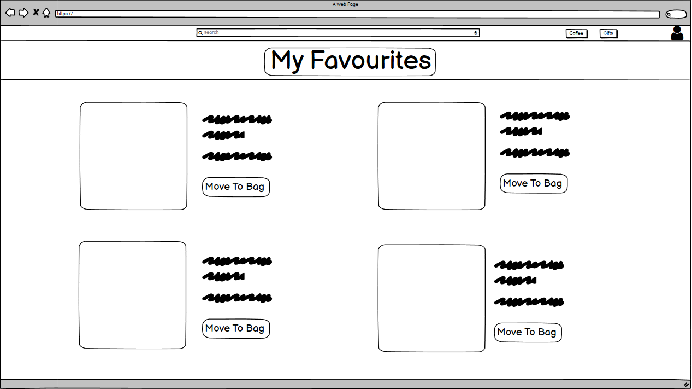

Bag page

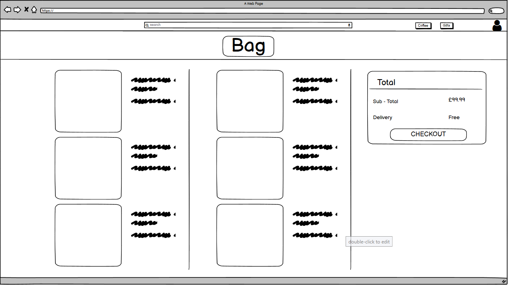

Mobile and tablet screen frames

Home page

Store pages

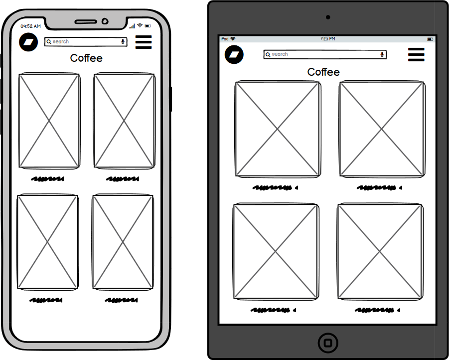

Account page

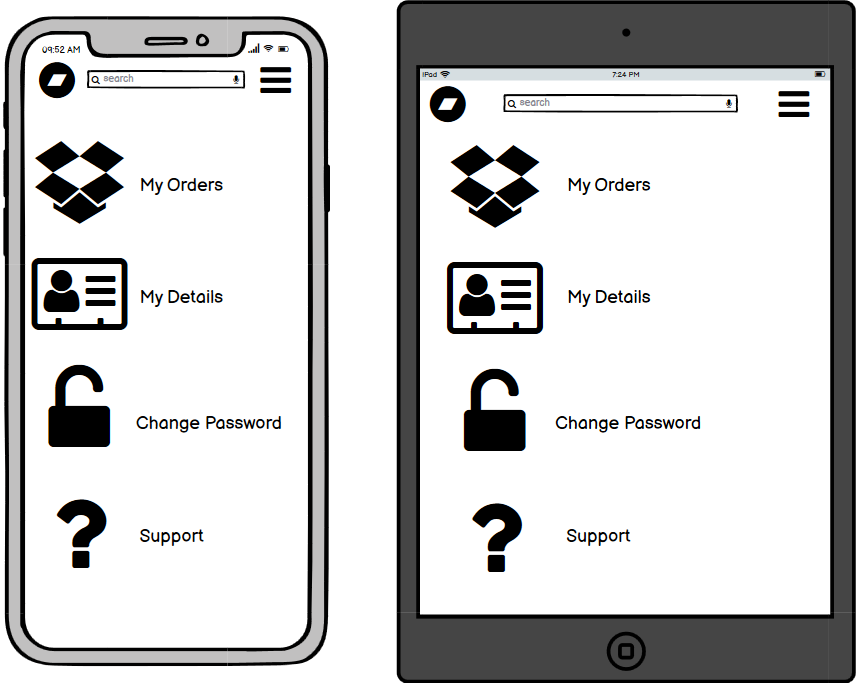

Favourites page

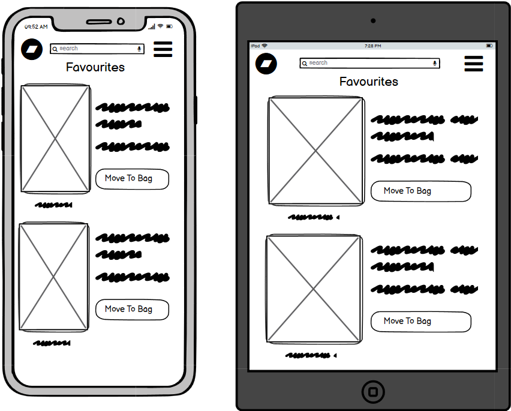

Bag page

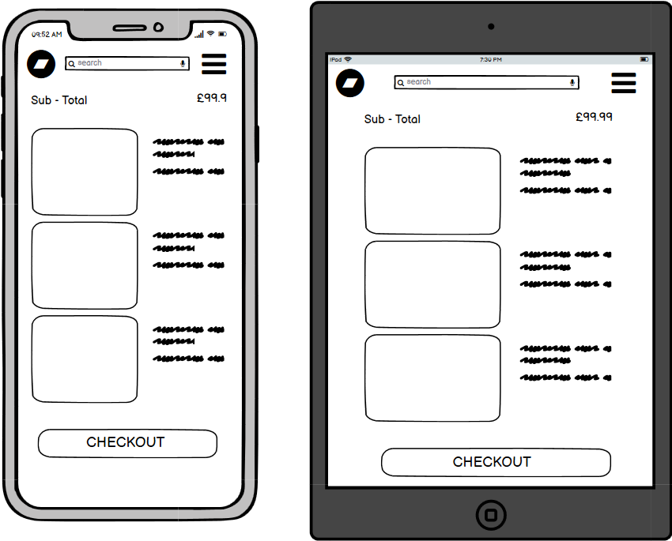

