# Coders Coffee

## **Table of Contents**
* [**UX**](#ux)
    * [User Stories](#user-stories)
* [**Agile**](#agile)
* [**Website Structure**](#website-structure)
    * [Wire Frames](#wire-frames)
* [**Existing Features**](#existing-features)
* [**Future Features**](#future-features)
* [**Testing**](#testing)
* [**Technologies Used**](#technologies-used)
* [**Credits**](#credits)


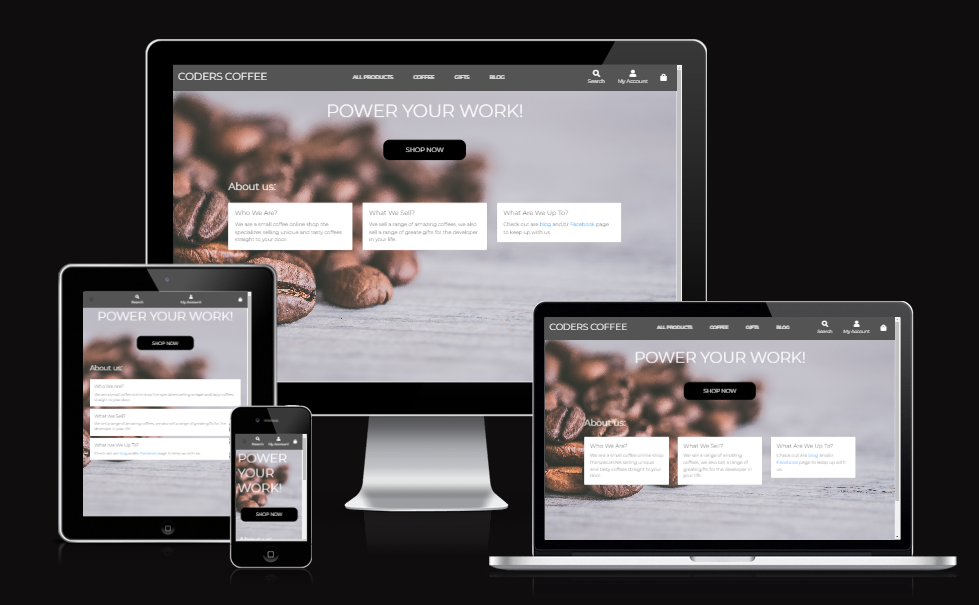


Coders Coffee is a website for coffee lovers to buy exciting new and different coffee's.
This website is aimed at coders with a gifts section with different mugs and coasters that make for a greate 
gift. The website also feature's a blog / news selection so user can see what the business is up to adding a personal touch to 
the business. 

## UX
### Ideal user demographic:
- Coffee lover
- Coder
- Gift giver

### Site Goals
- For this store I want users to easily be able to understand what the website sells and about the company.
- Users should easily be able to check products with minimal clicks.
- Returing customers must be able to save there details for an easier checkout the next time they order

The website needs to enable **Site users** to:
- Find Coffee new a exciting coffee or gifts for themselves, friends or family.
- Be able to add their products to a shooping bag to purchase within as few clicks as possible.
- Search and filter products to quickly find what they are looking for.
- Notified of when something happens, such as a product being added to the bag.
- View blog post by the business.

The website needs to enable **Registered users** to:
- Save information on checking out.
- Have a profile where they can update their information and see past orders
- Leave a Review on a product.

The website needs to enable **Site owners** to:
- Add, edit and delete products from the data base.
- View all orders from the admin panel.
- Review and remove ratings on products.
- Manage all user accounts.


### User Stories
#### Site User
- As a customer I can add or remove items from my basket so that I don't have items I don't want.
- As a customer I can choose from different sizes so that I have the best size to suit my needs.
- As a customer I can filter products (eg: by rating) so that I can find the most popular products quickly.
- As a customer I can search for a product by name so that I can quickly find a product.
- As a customer I can adjust the products in my bag so that I can quickly change an item if I add the quantity.
- As a customer I will receive a confirmation email so that I know my order has gone through.
- As a customer I can sort by a category so that I can only see products I'm interested in.
- As a site user I can receive notifications so that I know what's happen after I do something(eg: add an item to the bag).

#### Registered User
- As a customer I can leave a rating on a product so that I can help other customers with their product choices.
- As a customer I can create an account so that my details can be saved so that I can have an easier time checking out next time.
- As an account holder I can reset my password so that if I forget it I can get back into my account.
- As a customer I can receive a confirmation email so that I know my account registered.

#### Site Owner
- As a site owner I can update products so that they are up to date for customers.
- As a site owner I can delete old product so that customers cannot buy them when they aren't available.
- As a site owner I can create blog posts so that users can keep up to date with what the business is doing.
- As a site owner I can edit blog posts so that the information can be up to date.
- As a site owner I can delete a blog post so that **only relevant post will be there **

### Agile
In this project I used agile works flows to help keep on track and understand where my project is in the development cycle.

#### Kanban Board and Issues


Github Issues were used to create user stories which where placed into a [backlog](https://github.com/will23JD/Coders-Coffee/milestone/1). and added to a [project](https://github.com/users/will23JD/projects/2).
I used the Kanban board colums Todo, In progress and Done to keep track of user stories as I moved through the project. This kept me on track through the
cycle of development.

### e-Commerce Type
- This is a B2C(business to customer) e-commerce Website for coffee and developer themed gifts.

### Marketing Strategy
- **SEO** this is a when a business makes sure their website complies with current standards. SEO must be carefully managed so the website is not treaded as 
spam as for an e-commerce store this would mean no customers would be recommended the site. Good SEO is achived by having information in the header, articals,
asides, footer, ect... rather than just h1, h2 , h3 and so on. Another way of improving SEO is by having usefull meta keywords and description tags and not 
stuffing the page with the keyword. There are many other factors that go into measuring a websites value such as google Rater which are people who rate sites 
using the [Rater Guidelines](https://static.googleusercontent.com/media/guidelines.raterhub.com/en//searchqualityevaluatorguidelines.pdf).

- **Content Marketing** in the form of a newsletter using [Mailchimp](https://mailchimp.com/en-gb/grow-with-mailchimp/?gclid=CjwKCAjwpKyYBhB7EiwAU2Hn2QAWEN5sI9n6jDbOQY4ax3Wz7-mhpmMfsgzJSJIjXpXUk0_g2H9egxoCWpsQAvD_BwE&gclsrc=aw.dswas) as well as blog post where used in this site.
Content can be created and pushed to these channels to communicate with customer about new products changes to the business and more, this bring the customer closer 
to the business showing it to be a reliable, trustworthly place for information and products.

- **Social Media Marketing** this is an easy way to reach out to new and exsisting customers and build a community around your business. New, products and more can 
be shared to customer free or charge. Many social platforms also allow for paid promotion which an be a relitively cheap way to push your business out to more people.
This project took use of this with [facebook](https://www.facebook.com/Coders-Coffee-104392309072613) webstore.

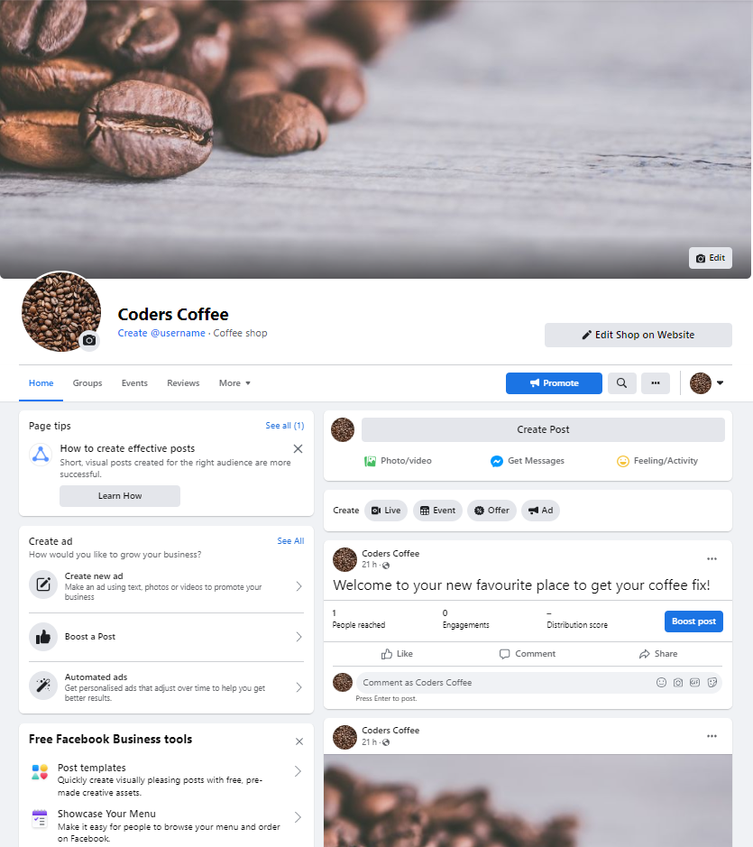

## Website Structure

### Database Schema
SQLite was used in the development of the site and Postgres by Heroku platform is being used in production. The diagram below shows the database models and the relationships between them.

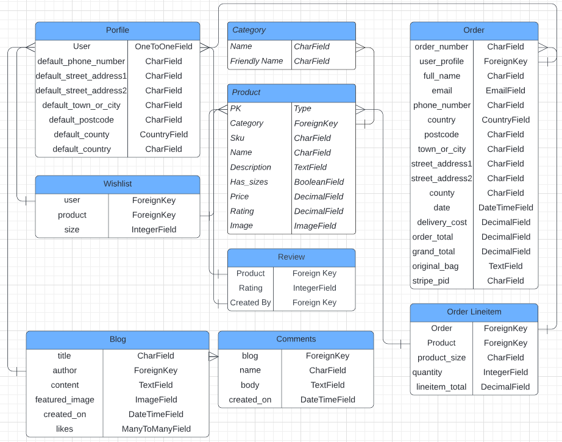

### Site Map
I use site map to see where different templates and apps would need to connect to allow the user easily navigate through the site.


### Wireframes
<hr>
<details>
<summary>Large screen frames</summary>
Home page


I wanted the home page to be clean simple but also provide users everything they need to access all areas of the site.

Store pages


For the main products page gave it a simple look to put the focus on the products. The page also features sort box which will allows uses
to sort based on their needs.

Account page


Favourites page


Bag page


</details>
<hr>
<details>
<summary>Mobile and tablet screen frames</summary>
Home page


Store pages


Account page


Favourites page


Bag page


</details>

### Design

#### Colours

In this project I kept a simple clean look, So for the colours I used a mix of grey and black. However on call to action buttons such as add to bag or coloured in the 
bootstrap success colour to make them stand out.

#### Text 

For this project I only user one font Montserrat to keep with the clean look. The font is versatile enough using uppercase to be sufficient for both headlines and other text.

## Existing Features

### NavBar and Footer


A sleek small navbar has been used on the site to keep it from disctracting from the content. The navbar is split into three sections:
The logo, links to the product which use bootstrap dropdowns to give more options and the blog, links to the account and bag apps.
This design is simple and familiar so user will have an easy time navigating the site.

The Footer follows to same design and features links to social platforms and and copyright tag.

### Products Page
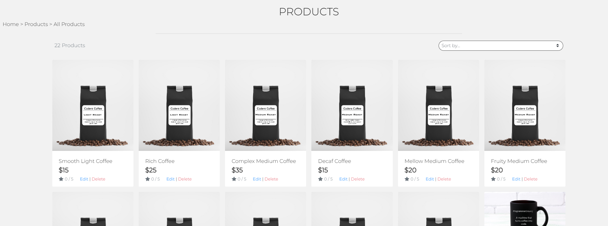

Using bootstap cards and django for statments, each product is rendered out in its own card. Mobile users will have 1 card per row encreasing to 6 on large screens.
Each card has the image of the product, name and rating. If the login user is super there will also be a edit and delete buttons.
When the product image is clicked the user will be taken to the products detail page.

### Product Detail Page
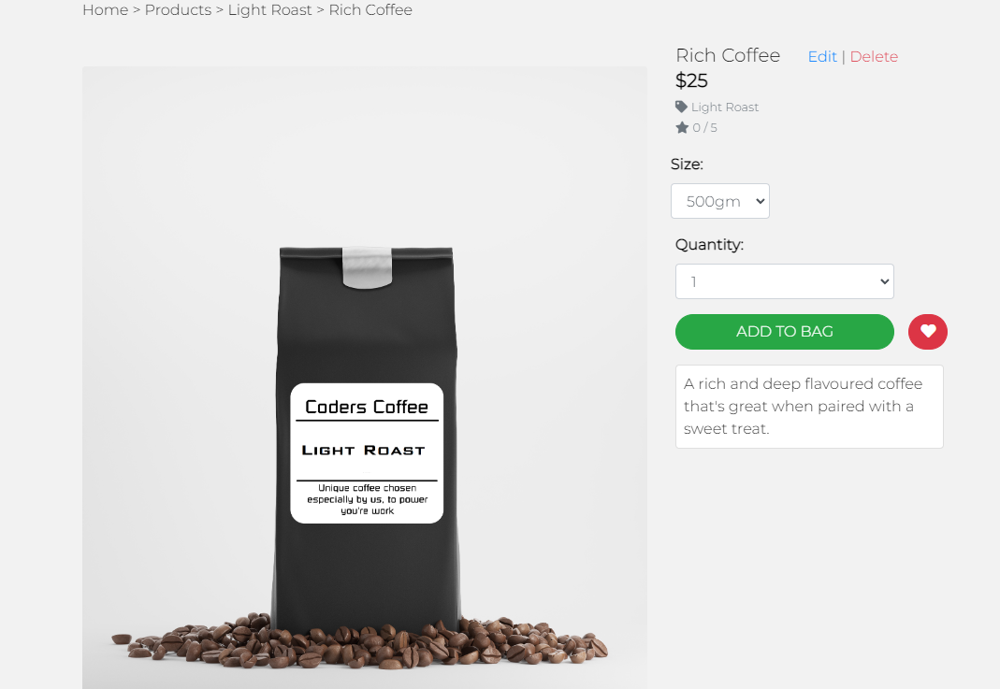

The product detail page is split into 2 halves on large screens then stacked on smaller screens.
On the right of the page is the product image, On the left there is the product name, rating, price, sizes(if it has them) and quantity. This is followed by the add the bag button and the wishlist button. This page also contains the description of the product at the end.

### Bag
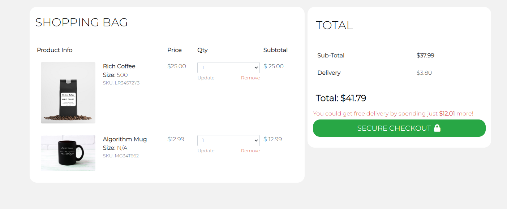

The bag page link the product detail page is split in to two sections. One containing a summary of the bag and buttons to update the quantity or remove a product in the bag.
The second contains the sub-total, delivery if there is any and the Total with a large Checkout button to take the use to checkout page.

### Checkout 


Keeping with the same style the checkout page is again split into two sections a small bag summery and then the checkout forms. Like the other pages these then stack
on smaller screen.
At the end of the forms there are to buttons one to go back to the bag and one to complete the order.

### Checkout Success
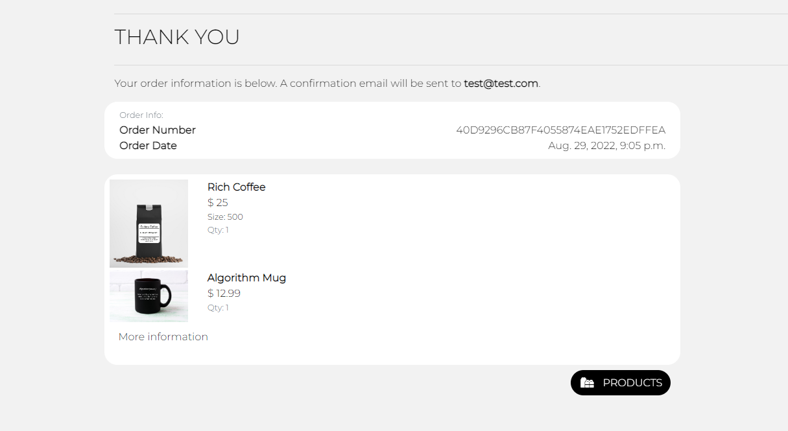

The checkout success page features a order number and date at the top followed by a summery of all the products order with there price, size and quantity listed.
After the summery there is a more information button which extends the page and shows all the order information like, delivery and billing. Last there is a products button
which takes the user back to the products page.

### Profile
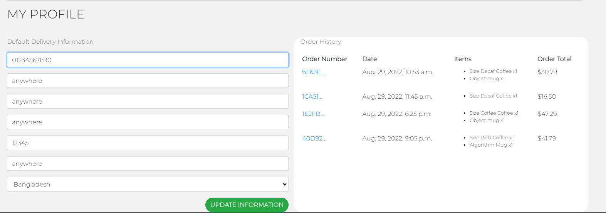

The profile page contains two sections then saved information and the order history. The user can update their information by changing the fields and then clicking update.
The order history shows all the orders made by that user, clicking on one will take them to the checkout success page with that order rendered out and replace the products button with a back to profile button.

### Wishlist
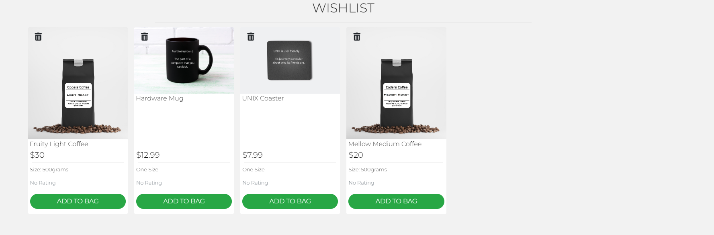

The wishlist page contains all the items a user has added to there wishlish. Like the products page the amount of cards per row decreses down to one on the smallest screens.
Clicking any product will take you to that products detail page, clicking the add to bag button will add the product straight to the bag and clicking the small bin icon at the top of the page will remove the item from the users wishlist.

### Blog
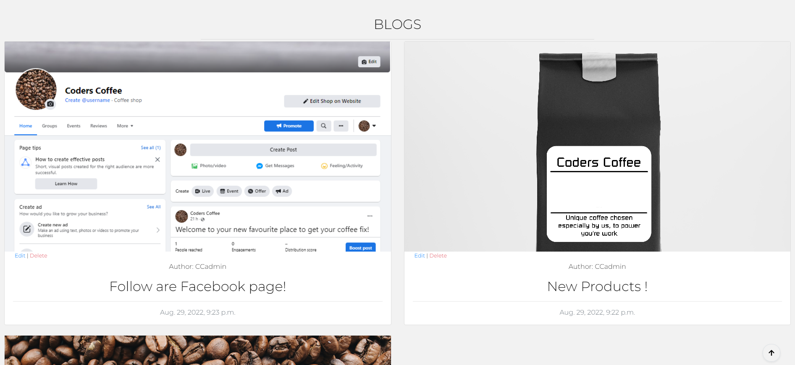

The blog page contains a list of all the blog posts. It features the blog image, title, creation and author. Clicking on the image will link the users to the bog detail page.
If a superuser is login they will also have buttons like the products to edit and delete the blog posts.

### Blog Detail
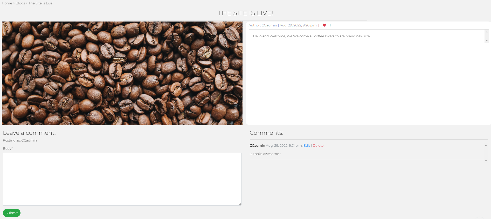

The blog detial page like the product detail page is split in two with the image taking one side and the blog information and content taking the other.
Next to author and creation date is a like button where the user can like the post. At the bottom of the page under the image is a comment form which allows login users to comment on the post, users can also edit and delete their own comments. Under the blog content is a list of all comments on the post, with the name of the user.

## Future Features

### Stock Management
- Have each item contain a sock count with this number decreasing with successful purchases of that product. This would mean that a product coudn't be purchased if there was no stock availiable.

### Auto Sreach Results
- Must like on google having suggested search option based on what the user is typing would mean users will have an easer time finding a product they are looking for.

## Testing
[TESTING.md](/TESTING.md)

## Technologies Used

### Languages Used
* [HTML5](https://en.wikipedia.org/wiki/HTML5)
* [CSS3](https://en.wikipedia.org/wiki/CSS)
* [Javascript](https://en.wikipedia.org/wiki/JavaScript)
* [Python](https://www.python.org/)

### Framework, Libraries and Programs used
* [Django](https://www.djangoproject.com/)

* [Allauth](https://django-allauth.readthedocs.io/en/latest/installation.html)

* [Gunicorn](https://docs.djangoproject.com/en/4.0/howto/deployment/wsgi/gunicorn/)

* [AWS](https://aws.amazon.com/free/?trk=d5254134-67ca-4a35-91cc-77868c97eedd&sc_channel=ps&s_kwcid=AL!4422!3!433803620858!e!!g!!aws&ef_id=CjwKCAjwx7GYBhB7EiwA0d8oey8lDT7FcqvPKFg8DEZo1A4bXYi_5LQlWUeovzRmR1A0hGp6AHZUsBoC_REQAvD_BwE:G:s&s_kwcid=AL!4422!3!433803620858!e!!g!!aws&all-free-tier.sort-by=item.additionalFields.SortRank&all-free-tier.sort-order=asc&awsf.Free%20Tier%20Types=*all&awsf.Free%20Tier%20Categories=*all)

* [PostgreSQL](https://www.postgresql.org/)

* [Summernote](https://summernote.org/)

* [Heroku](https://www.heroku.com/home)

* [Gitpod](https://www.gitpod.io/)

* [Git](https://git-scm.com/)

* [GitHub](https://github.com/)

* [Balsamiq](https://balsamiq.com/wireframes/)

* [Lucidchart](https://www.lucidchart.com/)

* [Google Fonts](https://fonts.google.com/)
 
* [Font Awesome](https://fontawesome.com/)

## Deployment

This project was developed using a [GitPod](https://gitpod.io/ "GitPod Site") workspace. The code was committed to Git and pushed to [GitHub](https://github.com/ "GitHub Site") using the terminal. The code was then remotely deployed to [Heroku](https://heroku.com/ "Heroku Site").

### Deploying on Heroku
To deploy this page to Heroku from its GitHub repository, the following steps were taken:

1. Create the Heroku App:
    1. Select "Create new app" in Heroku.
    2. Choose a name for your app and select the location.

2. Attach the Postgres database:
    1. In the Resources tab, under add-ons, type in Postgres and select the Heroku Postgres option.

3. Prepare the environment and settings.py file:
    1. In the Settings tab, click on Reveal Config Vars and copy the URL next to DATABASE_URL.
    2. In your GitPod workspace, create an env.py file in the main directory. 
    3. Add the DATABASE_URL value and your chosen SECRET_KEY value to the env.py file.
    4. Add the SECRET_KEY value to the Config Vars in Heroku.
    5. Update the settings.py file to import the env file and add the SECRETKEY and DATABASE_URL file paths.
    6. Update the Config Vars with the Cloudinary URL, adding into the settings.py file also.
    7. In settings.py add the following sections:
        - STATIC_URL
        - STATICFILES_DIRS
        - MEDIA_URL
        - MEDIA_ROOT
        - TEMPLATES_DIR
        - Update DIRS in TEMPLATES with TEMPLATES_DIR
        - Update ALLOWED_HOSTS with ['app_name.herokuapp.com', 'localhost']

4. Set DISABLE_COLLECTSTATIC and Deploy to Heroku:
    1. Create three directories in the main directory; media, storage and templates.
    2. Create a file named "Procfile" in the main directory and add the following:
        - web: gunicorn project-name.wsgi
    3. in the terminal, log in to Heroku(Heroku login -i) and then enter the following:
        - heroku config:set DISABLE_COLLECTSTATIC=1 --app (Heroku App Name)
    4. Go to the 'Deploy' tab on Heroku and connect to GitHub, then to the required repository.
    Click on 'Deploy Branch' and wait for the build to load. When the build is complete, the app can be opened through Heroku. 

### Forking the Repository
By forking the GitHub Repository we make a copy of the original repository on our GitHub.

1. Log into [GitHub](https://github.com/login "Link to GitHub login page") or [create an account](https://github.com/join "Link to GitHub create account page").
2. Locate the [GitHub Repository](https://github.com/rebeccatraceyt/KryanLive "Link to GitHub Repo").
3. At the top of the repository, on the right side of the page, select "Fork"
4. You should now have a copy of the original repository in your GitHub account.

### Creating a Clone
How to run this project locally:
1. Install the [GitPod Browser](https://www.gitpod.io/docs/browser-extension/ "Link to Gitpod Browser extension") Extension for Chrome.
2. After installation, restart the browser.
3. Log into [GitHub](https://github.com/login "Link to GitHub login page") or [create an account](https://github.com/join "Link to GitHub account page").
2. Locate the [GitHub Repository](https://github.com/rebeccatraceyt/KryanLive "Link to GitHub Repo").
5. Click the green "GitPod" button in the top right corner of the repository.
This will trigger a new GitPod workspace to be created from the code in GitHub where you can work locally.

How to run this project within a local IDE, such as VSCode:

1. Log into [GitHub](https://github.com/login "Link to GitHub login page") or [create an account](https://github.com/join "Link to GitHub account page").
2. Locate the [GitHub Repository](repo URL "Link to GitHub Repo").
3. Under the repository name, click "Clone or download".
4. In the Clone with HTTPs section, copy the clone URL for the repository.
5. In your local IDE open the terminal.
6. Change the current working directory to the location where you want the cloned directory to be made.
7. Type 'git clone', and then paste the URL you copied in Step 3.

```
git clone https://github.com/USERNAME/REPOSITORY
```

8. Press Enter. Your local clone will be created.

Further reading and troubleshooting on cloning a repository [here](https://docs.github.com/en/free-pro-team@latest/github/creating-cloning-and-archiving-repositories/cloning-a-repository "Link to GitHub troubleshooting")

## Credits

### Code 
- [CodeInstitue](https://codeinstitute.net/)
    - Help from boutique ado walk through: Setting django app up, deploy to
    heroku, basic stlyes and allauth.
- [Stack overflow](https://stackoverflow.com/)
    - Help with various bugs
- [Stock Adobe](https://stock.adobe.com/) - Used a free trail and cancled it.
    - source of all stock images.
- [Pexels](https://www.pexels.com/photo/coffee-beans-closeup-photography-867466/)
    - source for home image.


### Acknowledgements

- My Mentor for feedback throughout the project.
- Friends and family for help with testing and feedback
