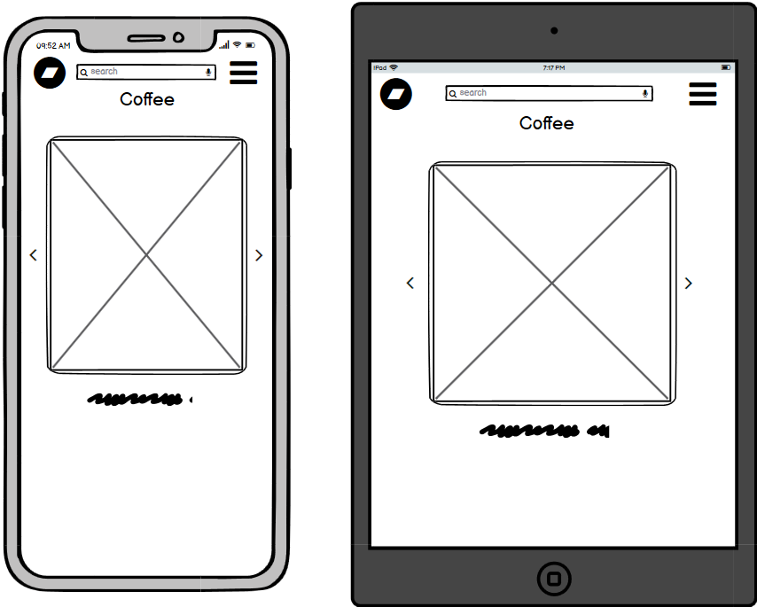

# Coders Coffee

Coders Coffee is a website for coffee lovers to buy exciting new and different coffee's.
This website is aimed at coders with a gifts section with different mugs and coasters that make for a greate 
gift. The website also feature's a blog / news selection so user can see what the business is up to adding a personal touch to 
the business. 

## User Experience (UX)
### Site Goals
- For this store I want users to easily be able to understand what the website sells and about the company.
- Users should easily be able to check products with minimal clicks.
- Returing customers must be able to save there details for an easier checkout the next time they order

### User Stories
- 

## Wireframes

Large screen frames

Home page

Store pages

Account page

Favourites page

Bag page

Mobile and tablet screen frames

Home page

Store pages

Account page

Favourites page

Bag page

