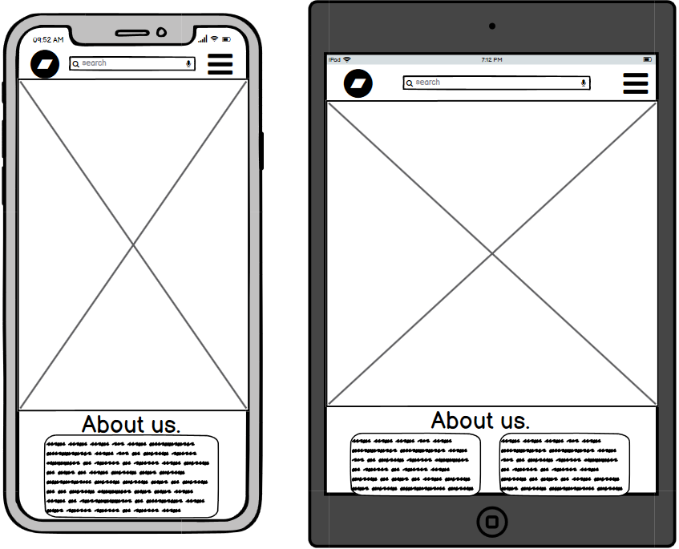

# Coders Coffee

Coders Coffee is a website for coffee lovers to buy exciting new and different coffee's.
This website is aimed at coders with a gifts section with different mugs and coasters that make for a greate 
gift. The website also feature's a blog / news selection so user can see what the business is up to adding a personal touch to 
the business. 

## User Experience (UX)
### Ideal user demographic:
- Coffee lover
- Coder
- Gift giver

### Site Goals
- For this store I want users to easily be able to understand what the website sells and about the company.
- Users should easily be able to check products with minimal clicks.
- Returing customers must be able to save there details for an easier checkout the next time they order

The website needs to enable **Site users** to:
- Find Coffee new a exciting coffee or gifts for themselves, friends or family.
- Be able to add their products to a shooping bag to purchase within as few clicks as possible.
- Search and filter products to quickly find what they are looking for.
- Notified of when something happens, such as a product being added to the bag.
- View blog post by the business.

The website needs to enable **Registered users** to:
- Save information on checking out.
- Have a profile where they can update their information and see past orders
- Leave a Review on a product.

The website needs to enable **Site owners** to:
- Add, edit and delete products from the data base.
- View all orders from the admin panel.
- Review and remove ratings on products.
- Manage all user accounts.


### User Stories
#### Site User
- As a customer I can add or remove items from my basket so that I don't have items I don't want.
- As a customer I can choose from different sizes so that I have the best size to suit my needs.
- As a customer I can filter products (eg: by rating) so that I can find the most popular products quickly.
- As a customer I can search for a product by name so that I can quickly find a product.
- As a customer I can adjust the products in my bag so that I can quickly change an item if I add the quantity.
- As a customer I will receive a confirmation email so that I know my order has gone through.
- As a customer I can sort by a category so that I can only see products I'm interested in.
- As a site user I can receive notifications so that I know what's happen after I do something(eg: add an item to the bag).

#### Registered User
- As a customer I can leave a rating on a product so that I can help other customers with their product choices.
- As a customer I can create an account so that my details can be saved so that I can have an easier time checking out next time.
- As an account holder I can reset my password so that if I forget it I can get back into my account.
- As a customer I can receive a confirmation email so that I know my account registered.

#### Site Owner
- As a site owner I can update products so that they are up to date for customers.
- As a site owner I can delete old product so that customers cannot buy them when they aren't available.
- As a site owner I can create blog posts so that users can keep up to date with what the business is doing.
- As a site owner I can edit blog posts so that the information can be up to date.
- As a site owner I can delete a blog post so that **only relevant post will be there **

## Agile
In this project I used agile works flows to help keep on track and understand where my project is in the development cycle.

### Kanban Board and Issues


Github Issues were used to create user stories which where placed into a [backlog](https://github.com/will23JD/Coders-Coffee/milestone/1). and added to a [project](https://github.com/users/will23JD/projects/2).
I used the Kanban board colums Todo, In progress and Done to keep track of user stories as I moved through the project. This kept me on track through the
cycle of development.

## Website Structure

### Site Map
I use site map to see where different templates and apps would need to connect to allow the user easily navigate through the site.


### Wireframes
<hr>
<details>
<summary>Large screen frames</summary>
Home page


I wanted the home page to be clean simple but also provide users everything they need to access all areas of the site.

Store pages


For the main products page gave it a simple look to put the focus on the products. The page also features sort box which will allows uses
to sort based on their needs.

Account page


Favourites page


Bag page


</details>
<hr>
<details>
<summary>Mobile and tablet screen frames</summary>
Home page



Store pages


Account page


Favourites page


Bag page


</details>

## Deployment

This project was developed using a [GitPod](https://gitpod.io/ "GitPod Site") workspace. The code was committed to Git and pushed to [GitHub](https://github.com/ "GitHub Site") using the terminal. The code was then remotely deployed to [Heroku](https://heroku.com/ "Heroku Site").

### Deploying on Heroku
To deploy this page to Heroku from its GitHub repository, the following steps were taken:

1. Create the Heroku App:
    1. Select "Create new app" in Heroku.
    2. Choose a name for your app and select the location.

2. Attach the Postgres database:
    1. In the Resources tab, under add-ons, type in Postgres and select the Heroku Postgres option.

3. Prepare the environment and settings.py file:
    1. In the Settings tab, click on Reveal Config Vars and copy the URL next to DATABASE_URL.
    2. In your GitPod workspace, create an env.py file in the main directory. 
    3. Add the DATABASE_URL value and your chosen SECRET_KEY value to the env.py file.
    4. Add the SECRET_KEY value to the Config Vars in Heroku.
    5. Update the settings.py file to import the env file and add the SECRETKEY and DATABASE_URL file paths.
    6. Update the Config Vars with the Cloudinary URL, adding into the settings.py file also.
    7. In settings.py add the following sections:
        - STATIC_URL
        - STATICFILES_DIRS
        - MEDIA_URL
        - MEDIA_ROOT
        - TEMPLATES_DIR
        - Update DIRS in TEMPLATES with TEMPLATES_DIR
        - Update ALLOWED_HOSTS with ['app_name.herokuapp.com', 'localhost']

4. Set DISABLE_COLLECTSTATIC and Deploy to Heroku:
    1. Create three directories in the main directory; media, storage and templates.
    2. Create a file named "Procfile" in the main directory and add the following:
        - web: gunicorn project-name.wsgi
    3. in the terminal, log in to Heroku(Heroku login -i) and then enter the following:
        - heroku config:set DISABLE_COLLECTSTATIC=1 --app (Heroku App Name)
    4. Go to the 'Deploy' tab on Heroku and connect to GitHub, then to the required repository.
    Click on 'Deploy Branch' and wait for the build to load. When the build is complete, the app can be opened through Heroku. 

### Forking the Repository
By forking the GitHub Repository we make a copy of the original repository on our GitHub.

1. Log into [GitHub](https://github.com/login "Link to GitHub login page") or [create an account](https://github.com/join "Link to GitHub create account page").
2. Locate the [GitHub Repository](https://github.com/rebeccatraceyt/KryanLive "Link to GitHub Repo").
3. At the top of the repository, on the right side of the page, select "Fork"
4. You should now have a copy of the original repository in your GitHub account.

### Creating a Clone
How to run this project locally:
1. Install the [GitPod Browser](https://www.gitpod.io/docs/browser-extension/ "Link to Gitpod Browser extension") Extension for Chrome.
2. After installation, restart the browser.
3. Log into [GitHub](https://github.com/login "Link to GitHub login page") or [create an account](https://github.com/join "Link to GitHub account page").
2. Locate the [GitHub Repository](https://github.com/rebeccatraceyt/KryanLive "Link to GitHub Repo").
5. Click the green "GitPod" button in the top right corner of the repository.
This will trigger a new GitPod workspace to be created from the code in GitHub where you can work locally.

How to run this project within a local IDE, such as VSCode:

1. Log into [GitHub](https://github.com/login "Link to GitHub login page") or [create an account](https://github.com/join "Link to GitHub account page").
2. Locate the [GitHub Repository](repo URL "Link to GitHub Repo").
3. Under the repository name, click "Clone or download".
4. In the Clone with HTTPs section, copy the clone URL for the repository.
5. In your local IDE open the terminal.
6. Change the current working directory to the location where you want the cloned directory to be made.
7. Type 'git clone', and then paste the URL you copied in Step 3.

```
git clone https://github.com/USERNAME/REPOSITORY
```

8. Press Enter. Your local clone will be created.

Further reading and troubleshooting on cloning a repository [here](https://docs.github.com/en/free-pro-team@latest/github/creating-cloning-and-archiving-repositories/cloning-a-repository "Link to GitHub troubleshooting")
