[Back to readme](/README.md)

***
## Table of contents
1. [User Story Testing](#user-story-testing)
2. [Manual Testing](#manual-testing)
3. [Automated Testing](#automated-testing) 
     - [Code Validation](#code-validator-testing)
4. [User Testing](#user-testing)

***

## User Story Testing

### Site User
- As a customer I can add or remove items from my basket so that I don't have items I don't want.
    - When in the bag app there is a remove button next to each item allowing the user to remove it from the bag.
- As a customer I can choose from different sizes so that I have the best size to suit my needs.
    - If a product has sizes there will be a drop down box allowing the user to select a size.
- As a customer I can filter products (eg: by rating) so that I can find the most popular products quickly.
    - When on the products page user as able to filter by a list of option such as rating.
- As a customer I can search for a product by name so that I can quickly find a product.
    - At any page on website a users can easily sreach for a product by clicking the search button.
- As a customer I can adjust the products in my bag so that I can quickly change an item if I add the quantity.
    - When in the bag app like the remove button there is a drop down allowing a user to select a new quantity and update the bag.
- As a customer I will receive a confirmation email so that I know my order has gone through.
    - When a order is place a user will revecie an email with their order information.
- As a customer I can sort by a category so that I can only see products I'm interested in.
    - In the navbar there are two main drop downs with all the catogries listed allowing a user to only look in one catagory.
- As a site user I can receive notifications so that I know what's happen after I do something(eg: add an item to the bag).
    - The website includes full CRUD functionality notifying the user of any action they take.

### Registered User
- As a customer I can leave a rating on a product so that I can help other customers with their product choices.
    - After you have purchased a product and are login you can view your order and click on add a review on any product to add a review.
- As a customer I can create an account so that my details can be saved so that I can have an easier time checking out next time.
    - When login during the checkout you can click to save your details to your account.
- As an account holder I can reset my password so that if I forget it I can get back into my account.
- As a customer I can receive a confirmation email so that I know my account registered.
    - When creating an account a confirmation email will be sent asking to verify the email.

### Site Owner
- As a site owner I can update products so that they are up to date for customers.
    - When viewing any product or product detail a superuser will have the option to edit it.
- As a site owner I can delete old product so that customers cannot buy them when they aren't available.
    - The same as with editing a product a superuser will be able to delete any product.
- As a site owner I can create blog posts so that users can keep up to date with what the business is doing.
    - When login in as a superuser there is a add blog link in the allowing them to create a new blog post.
- As a site owner I can edit blog posts so that the information can be up to date.
    - When viewing any blog or blog detail a superuser will have the option to edit it.
- As a site owner I can delete a blog post so that **only relevant post will be there **
    - When viewing any blog or blog detail a superuser will have the option to delete it.

## Manual Testing

General Testing

Products

Bag

Checkout

Profile

Blog

## Automated Testing

### Code Validator Testing
- HTML validation was done by [W3C HTML](https://validator.w3.org/).
- CSS validation was done by [W3C CSS](https://jigsaw.w3.org/css-validator/).
- python validation was done by [PEP8 online](http://pep8online.com/).
- javascript validation was done by [jshint](https://jshint.com/).

HTML validation

- Home page

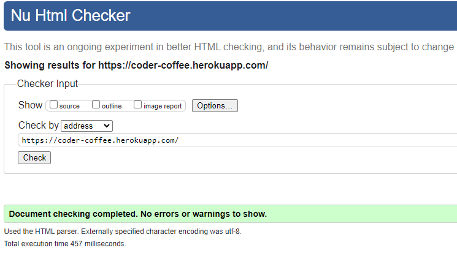

- All Products page

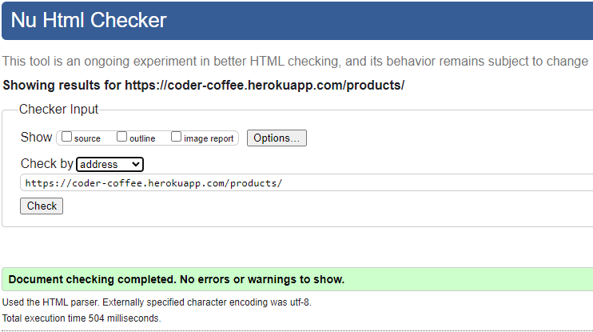

- Product Detail page

- Product Edit page 

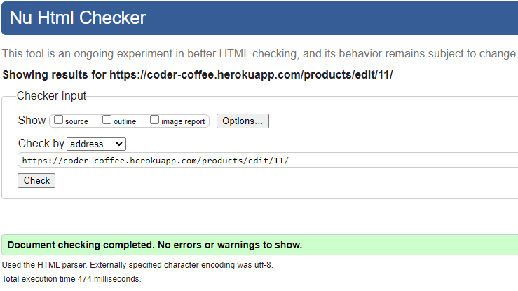

- Product Add page

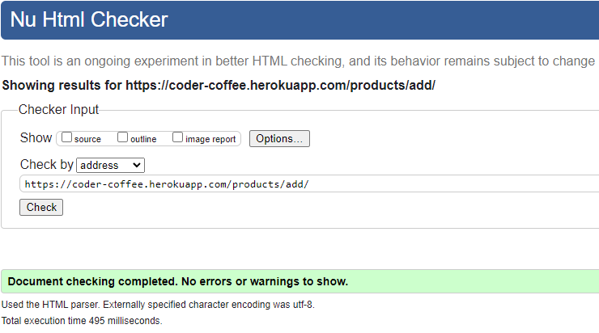

- Product Review page

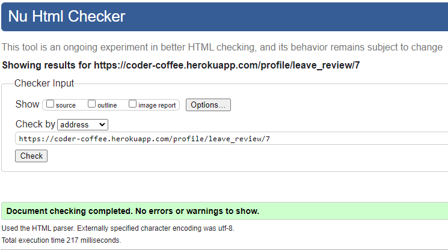

- Bag page

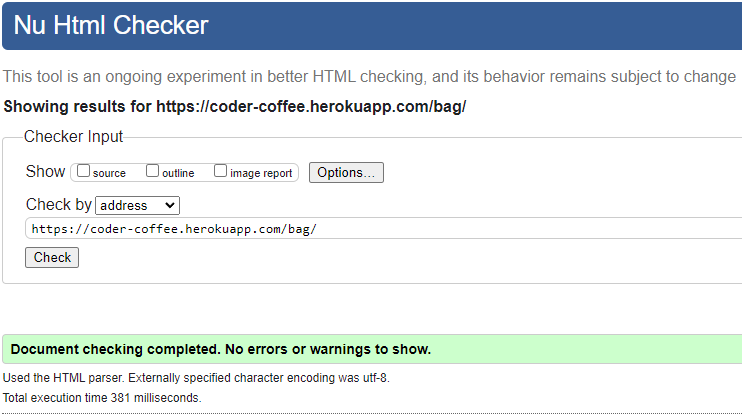

- Checkout page

- Checkout Success page

- Profile page

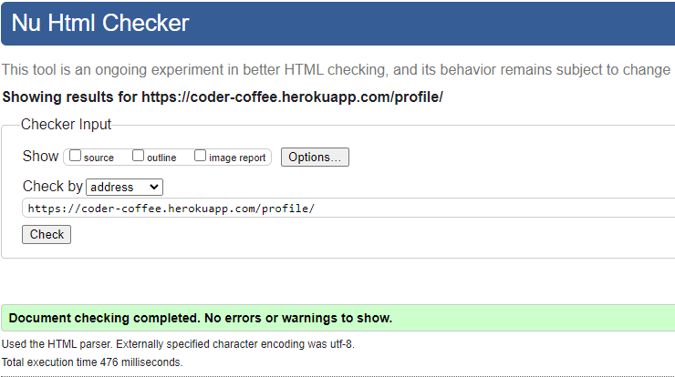

- Blog page

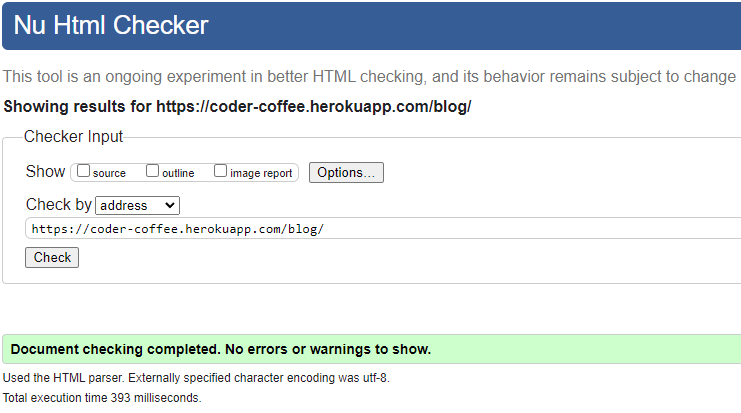

- Blog Detail page

- Blog Edit page 

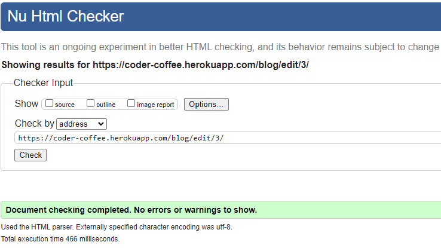

- Blog Add page

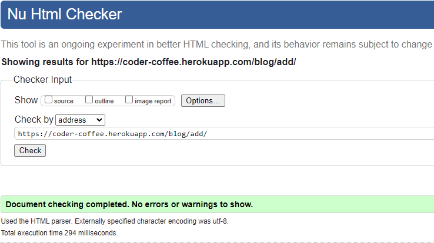

CSS validation

- Base CSS

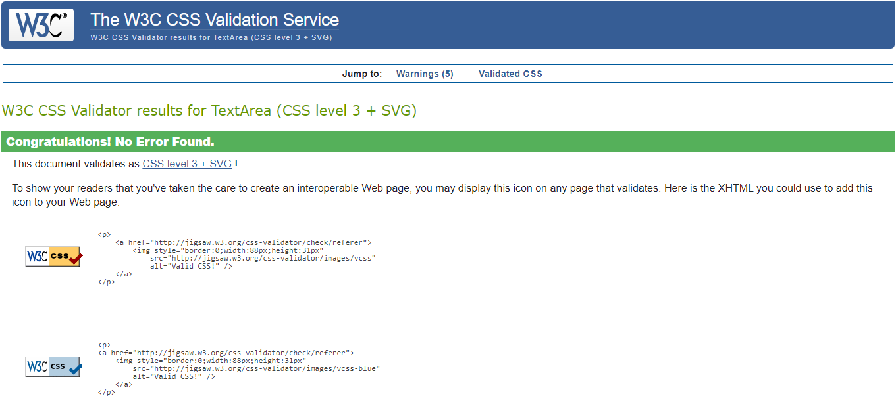

- Checkout CSS

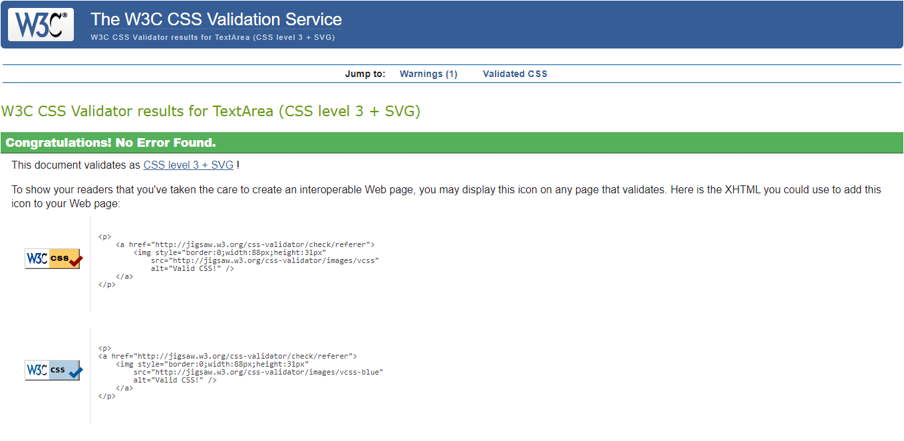

Python validation

- Product Model Python

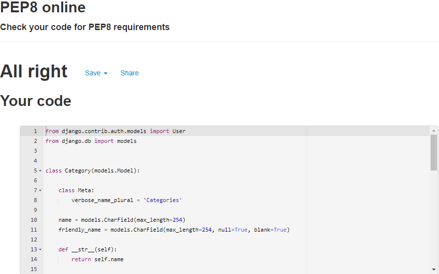

- Product View Python

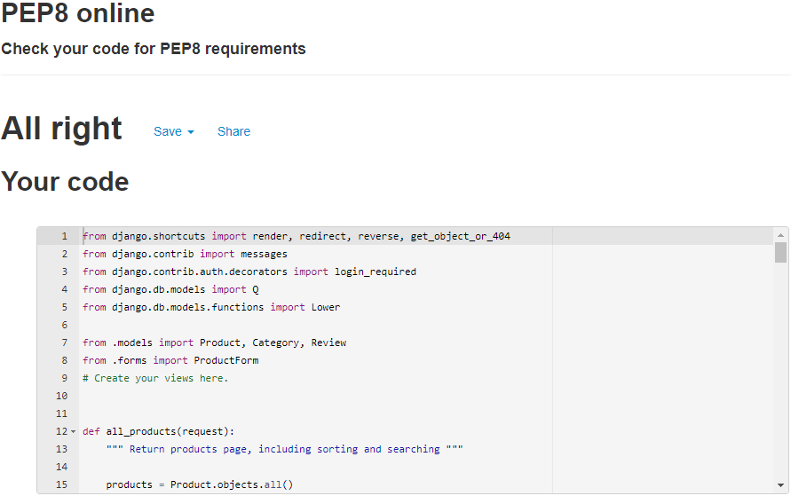

- Bag View Python

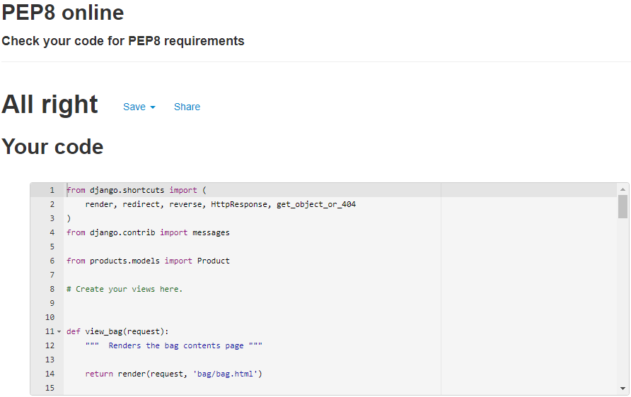

- Bag Context Python

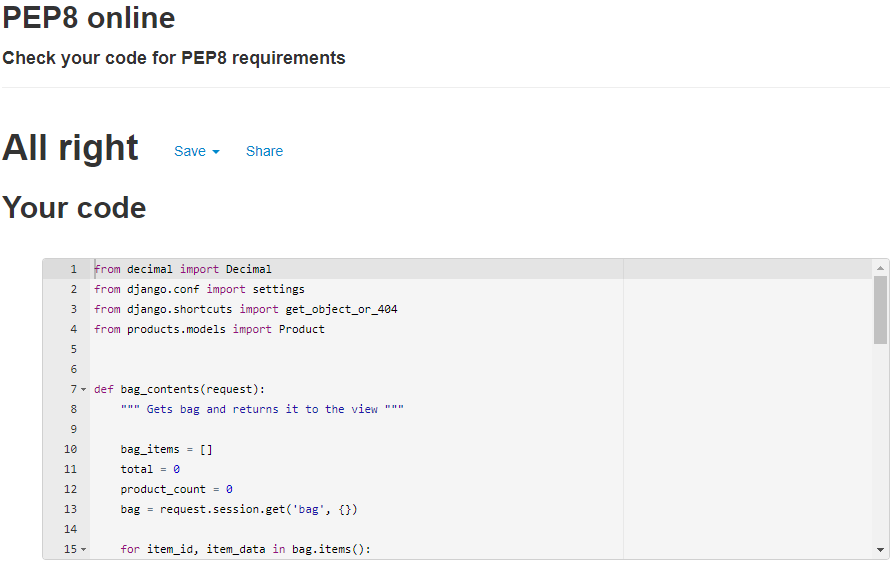

- Checkout Model Python

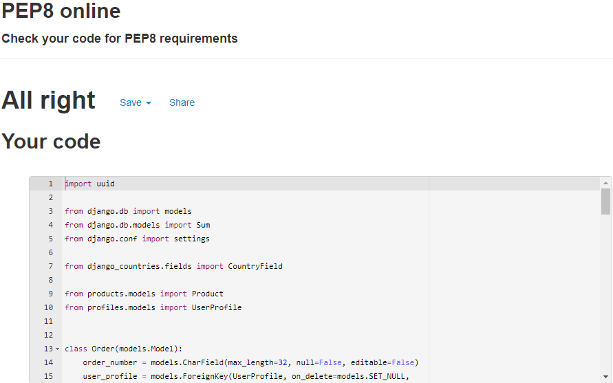

- Checkout View Python

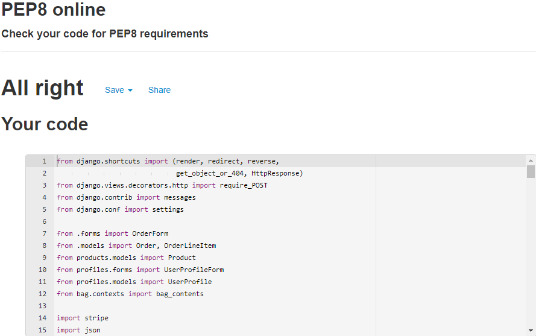

- Profile Model Python

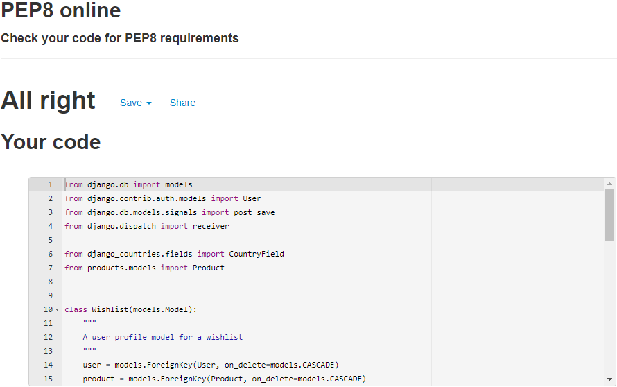

- Profile View Python

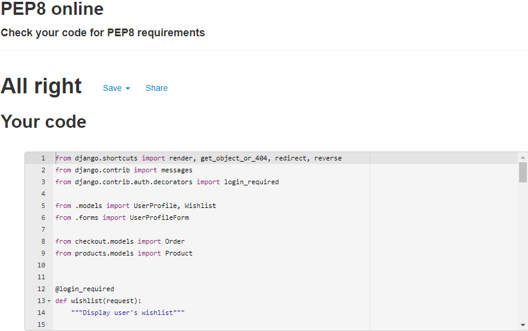

- Blog Model Python

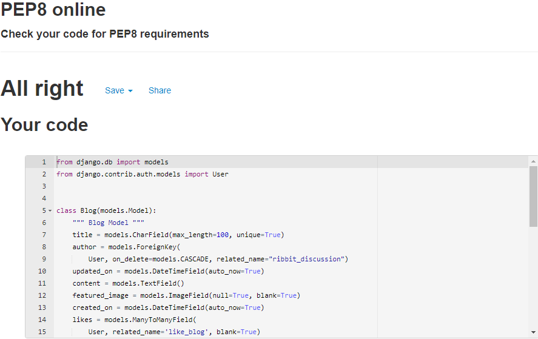

- Blog Form Python

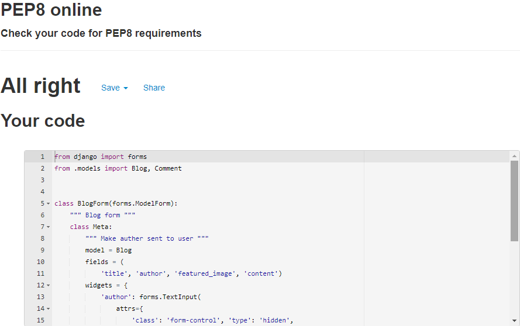

javascript validation

- Base js 

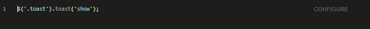

- Profile js

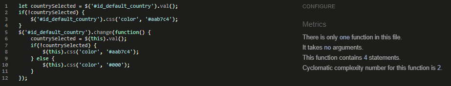

- Finalprice js

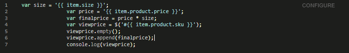

- Showprice js

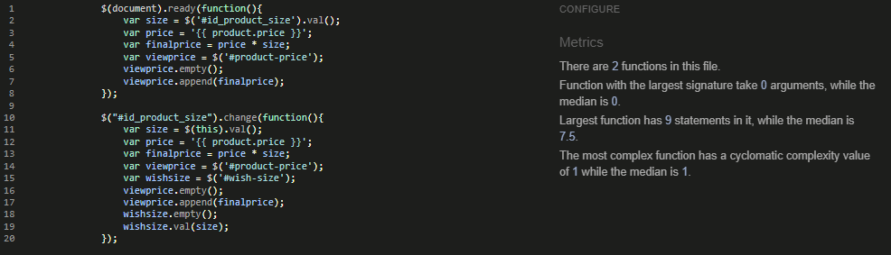

- Get Rating js

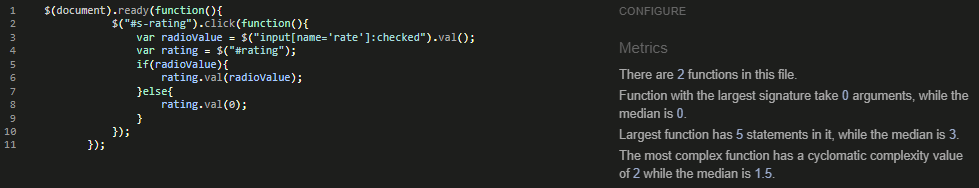

- Stripe js

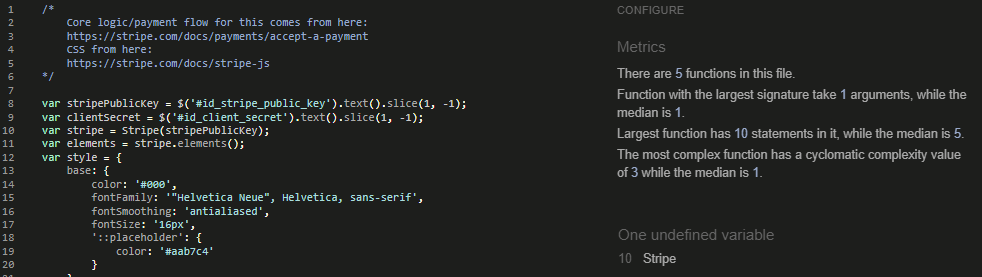

- Checkout js

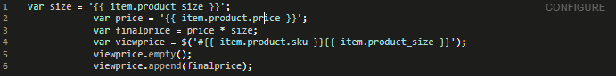

- Bag js

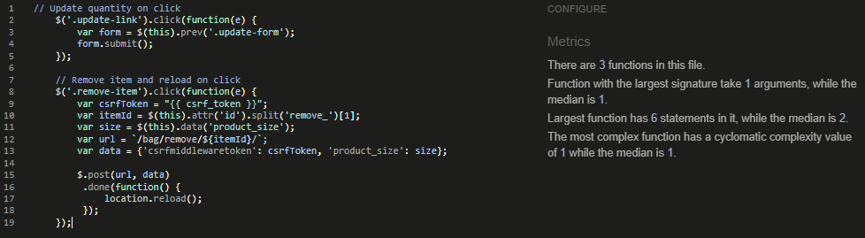

- Add Blog js

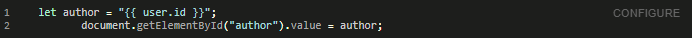

- Comment js

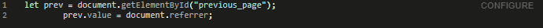

